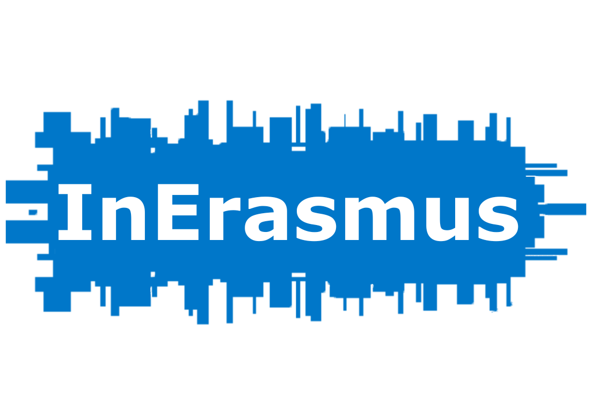

## Overview

**In Erasmus** is a platform designed to assist Erasmus participants and prospective students by providing valuable
information, facilitating connections with alumni, and offering a real-time virtual assistant. This application employs
a freemium business model, providing both free and premium features to enhance the user experience.

## Features

### Free Features

- **Feedback and Review Visualization:** Users can view feedback and reviews from other participants.
- **Event Listings:** Information on relevant events is available.
- **Search Functionality:** A robust search feature to find necessary information quickly.

### Premium Features

- **Direct Messaging and Interaction:** Premium users can directly message and interact with other users.
- **Mentorship Sessions:** Access to mentorship sessions for guidance and advice.
- **Achievements System:** Track and showcase achievements within the platform.

## Business Model: Freemium

The platform operates on a freemium model where users can access basic features for free, with an option to upgrade to
premium features for an enhanced experience.

## Running the Application

To run the **In Erasmus** application, you need to have Docker installed. Follow the steps below to get the application
up and running:

1. **Clone the Repository:**
   ```sh
   git clone <repository-url>
   cd <repository-directory>
   ```
2. **Run docker compose:**
   ```sh
   docker-compose up
   ```
